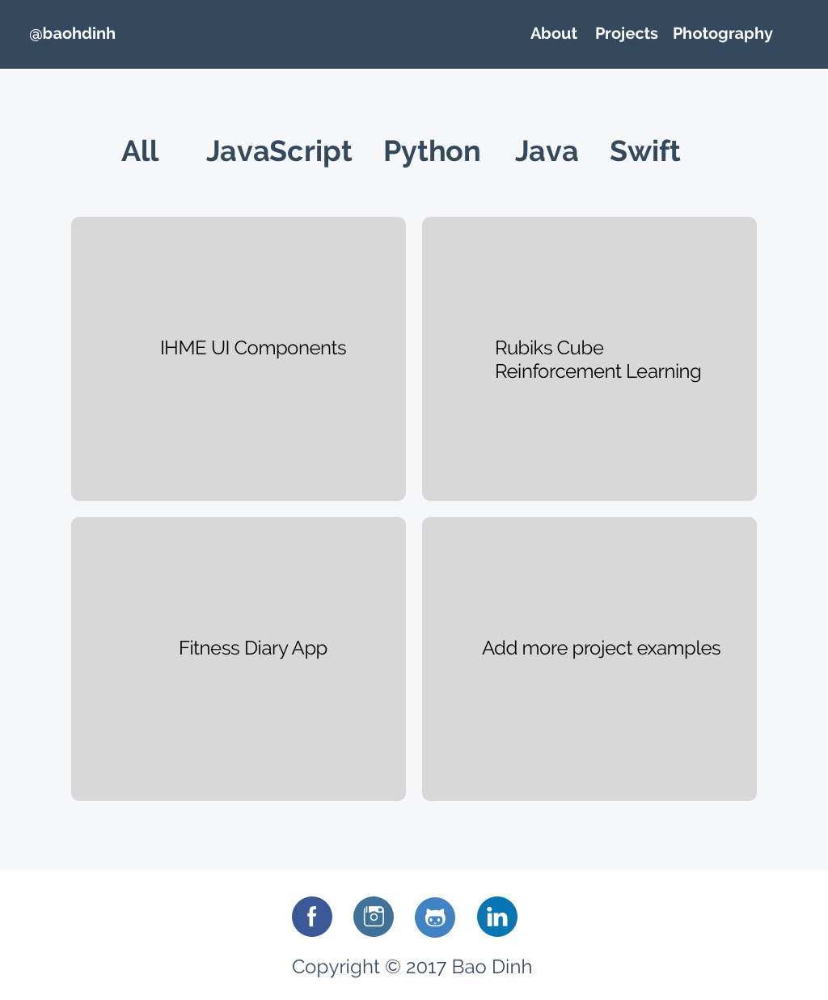
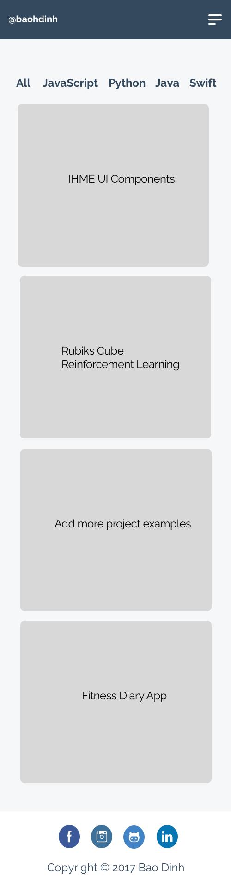

# Promotional Site Design
This portion of the repository contains the initial designs created to help **guide** the development process in creating my promotional site. The designs were created with a mobile first approach and indeed followed responsive web design guidelines. Although the designs are not exhaustive, they serve as a general idea in the development process. Included are **png(s)**, a **pdf**, as well as a **Sketch** design.  

## Home Page 
Medium & Large Screen Size

Extra Small & Small

## Projects Page 
Medium & Large Screen Size

Extra Small & Small

## Photography Page 
Medium & Large Screen Size

Extra Small & Small

